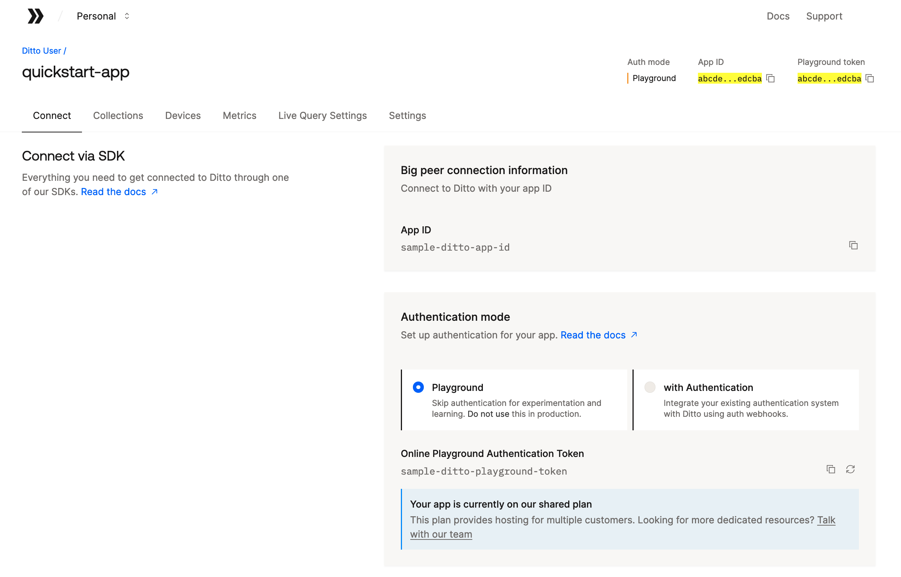

# Ditto Quickstart Apps 🚀

This repo contains apps for many of our supported programming languages to show
how Ditto works as quickly as possible.

## Obtaining your Ditto Identity

The Ditto SDK requires you to provide an identity for your application, which may be
generated using the [Ditto Portal](https://portal.ditto.live/). For the purposes of these
quickstart applications, we'll be using the "Online Playground" identity type.

> [!IMPORTANT]
> The Online Playground identity type is _not_ suitable for production use. It is intended
> only for development and testing purposes.

To obtain your Ditto identity and configure the quickstart apps with it, follow these steps:

1. Create a free account in the [Ditto Portal](https://portal.ditto.live/).
1. Create an app in the Ditto Portal.
1. Copy the `.env.sample` file to `.env`.
   - in a terminal: `cp .env.sample .env`.
   - in a macOS Finder window, press `⇧⌘.` (SHIFT+CMD+period) to show hidden files.
1. Save your app ID and online playground token in the `.env` file.

Please see the app-specific README files for details on the tools necessary to
build and run them.

## Apps

- [Android Kotlin](android-kotlin/README.md)
- [Android Java](android-java/README.md)
- [Android C++](android-cpp/README.md)
- [C++ TUI](cpp-tui/README.md)
- [C# .NET MAUI](dotnet-maui/README.md)
- [C# .NET TUI](dotnet-tui/README.md)
- [Flutter](flutter_quickstart/README.md)
- [Javascript TUI](javascript-tui/README.md)
- [Javascript Web](javascript-web/README.md)
- [React Native](react-native/README.md)
- [Rust TUI](rust-tui/README.md)
- [Swift](swift/README.md)

## 🔨 Building

This repo uses [just](https://just.systems/) to launch various build commands.
Run `just` without any arguments to view a list of the available recipes.
The full commands can be viewed in the root [`justfile`](justfile).

## 📄 License

This repo is licensed under the MIT License. See the [LICENSE](LICENSE) file for
rights and limitations.
