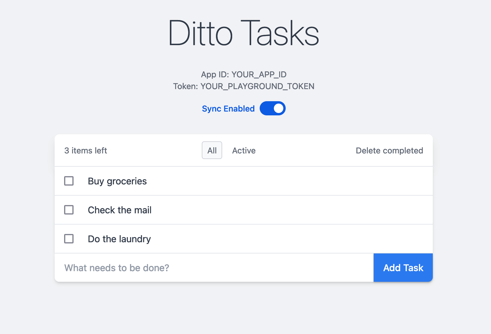

# Ditto JS Web Quickstart App 🚀

This directory contains Ditto's quickstart app for in-browser web applications.
This app uses Vite along with Typescript and React, and shows how to include
the Ditto SDK in a client-side app running in the browser.



## Documentation

- [Javascript Install Guide](https://docs.ditto.live/sdk/latest/install-guides/js)
- [Javascript API Reference](https://software.ditto.live/js/Ditto/4.11.1/api-reference/)
- [Javascript Release Notes](https://docs.ditto.live/sdk/latest/release-notes/js)

## Getting Started

To get started, you'll first need to create an app in the [Ditto Portal][0]
with the "Online Playground" authentication type. You'll need to find your
AppID and Playground Token in order to use this quickstart.

[0]: https://portal.ditto.live

From the repo root, copy the `.env.sample` file to `.env`, and fill in the
fields with your AppID and Playground Token:

```
cp .sample.env .env
```

The `.env` file should look like this (with your fields filled in):

```bash
#!/usr/bin/env bash

# Copy this file from ".env.sample" to ".env", then fill in these values
# A Ditto AppID, Playground token, Auth URL, and Websocket URL can be obtained from https://portal.ditto.live
DITTO_APP_ID=""
DITTO_PLAYGROUND_TOKEN=""
DITTO_AUTH_URL=""
DITTO_WEBSOCKET_URL=""
```

Next, run the quickstart app with the following command:

```
npm && npm run dev
```
